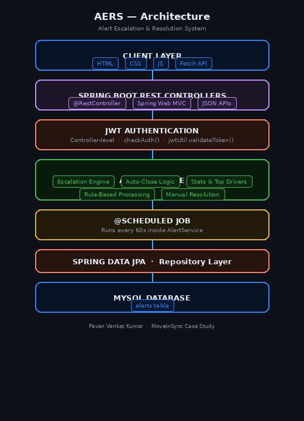

# AERS — Alert Escalation & Resolution System

> Intelligent Fleet Alert Monitoring with Automated Escalation & Resolution

[](https://openjdk.org/projects/jdk/17/)
[](https://spring.io/projects/spring-boot)
[](https://www.mysql.com/)
[](https://jwt.io/)
[](./LICENSE)

---

## 📋 Overview

**AERS** is a production-grade intelligent alert management platform built with **Spring Boot**. It simulates real-world fleet monitoring operations ingesting driver alerts from multiple sources, applying rule-based escalation logic, auto-closing resolved alerts, and surfacing real-time analytics for operations teams.

Developed as part of the **MoveInSync Intelligent Alert Escalation Case Study**.

**👨‍💻 Author:** Pavan Venkat Kumar &nbsp;|&nbsp; **GitHub:** [@pavandoddavarapu](https://github.com/pavandoddavarapu)

---

## 🎯 Problem Statement

Design and implement an intelligent alert management system capable of:

- Processing alerts from multiple driver/vehicle sources
- Automatically escalating unresolved critical alerts
- Allowing manual resolution by the operations team
- Auto-closing alerts after defined conditions are met
- Providing real-time analytics and monitoring dashboards
- Securing all APIs with token-based authentication

---

## ✨ Key Features

| Feature | Description |
|---------|-------------|
| 🚨 Multi-Source Alert Ingestion | Accepts alerts from `panic`, `overspeeding`, `feedback`, and more |
| ⚡ Rule-Based Escalation | Configurable thresholds automatically upgrade alert severity |
| ⏱️ Background Scheduler | Spring `@Scheduled` job runs every minute handling escalation & auto-close |
| 🛠️ Manual Resolution | JWT-protected endpoint for operations team to resolve alerts |
| 👨‍🚗 Driver Drill-Down | Complete alert history and escalation timeline per driver |
| 📊 Analytics Dashboard | Live stats, top offenders, trend graphs with auto-refresh |
| 🔐 JWT Authentication | Stateless token-based security on all sensitive endpoints |

---

## 🏗️ Architecture



### Tech Stack

| Layer | Technology |
|-------|-----------|
| Language | Java 17 |
| Framework | Spring Boot 3.x |
| REST | Spring Web (MVC) |
| Persistence | Spring Data JPA + MySQL 8 |
| Background Jobs | Spring `@Scheduled` |
| Authentication | JWT (stateless) |
| Frontend | HTML + CSS + Vanilla JavaScript |
| Visualisation | Chart.js |

---

## 🧠 Alert Lifecycle

```
OPEN
 ├─→ ESCALATED   (auto — scheduler threshold breached)
 ├─→ RESOLVED    (manual — operations team)
 └─→ AUTO_CLOSED (timeout — condition met)

ESCALATED → RESOLVED → AUTO_CLOSED
```

---

## 📡 API Reference

### 🔐 Step 1 — Authenticate

All protected endpoints require a **Bearer token** in the request header.

**`POST /auth/login`**

```json
// Request Body
{
  "username": "admin",
  "password": "admin"
}
```

```json
// Response 200
{
  "token": "eyJhbGciOiJIUzI1NiJ9..."
}
```

Copy the token and attach it to all subsequent requests:

```
Authorization: Bearer <your_token_here>
Content-Type: application/json
```

---

### 🚨 Alert Endpoints

> All endpoints below require the `Authorization` header.

---

#### 1. Create Alert — `POST /alerts`

```json
// Request Body
{
  "driverId": "DRV101",
  "sourceType": "panic",
  "severity": "CRITICAL",
  "metadata": "SOS button pressed"
}
```

```json
// Response 201
{
  "alertId": 12,
  "driverId": "DRV101",
  "sourceType": "panic",
  "severity": "CRITICAL",
  "status": "OPEN",
  "escalationLevel": 0,
  "timestamp": "2026-02-23T20:10:45"
}
```

---

#### 2. Get All Alerts — `GET /alerts`

```json
// Response 200
[
  {
    "alertId": 12,
    "driverId": "DRV101",
    "sourceType": "panic",
    "severity": "CRITICAL",
    "status": "OPEN",
    "escalationLevel": 1,
    "timestamp": "2026-02-23T20:10:45"
  }
]
```

---

#### 3. Resolve Alert — `PUT /alerts/{id}/resolve`

No request body required.

```
PUT /alerts/12/resolve
```

```
// Response 200
"Alert resolved successfully"
```

After resolution, the alert `status` transitions to `"RESOLVED"`.

---

#### 4. Driver Alert History — `GET /alerts/driver/{driverId}`

```
GET /alerts/driver/DRV101
```

```json
// Response 200
[
  {
    "alertId": 10,
    "driverId": "DRV101",
    "sourceType": "overspeed",
    "severity": "WARNING",
    "status": "AUTO_CLOSED",
    "escalationLevel": 0
  },
  {
    "alertId": 12,
    "driverId": "DRV101",
    "sourceType": "panic",
    "severity": "CRITICAL",
    "status": "RESOLVED",
    "escalationLevel": 1
  }
]
```

---

#### 5. Top Offending Drivers — `GET /alerts/top-drivers`

```json
// Response 200
[
  "DRV101 -> 5 alerts",
  "DRV205 -> 3 alerts",
  "DRV309 -> 2 alerts"
]
```

---

#### 6. Alert Statistics — `GET /alerts/stats`

```
// Response 200
Total: 15 | Open: 3 | Resolved: 7
```

---

### Quick Reference Table

| Method | Endpoint | Auth | Description |
|--------|----------|:----:|-------------|
| `POST` | `/auth/login` | ❌ | Get JWT token |
| `POST` | `/alerts` | ✅ | Create a new alert |
| `GET` | `/alerts` | ✅ | Retrieve all alerts |
| `PUT` | `/alerts/{id}/resolve` | ✅ | Manually resolve an alert |
| `GET` | `/alerts/driver/{driverId}` | ✅ | Alert history for a driver |
| `GET` | `/alerts/top-drivers` | ✅ | Top drivers by alert count |
| `GET` | `/alerts/stats` | ✅ | Aggregated alert statistics |

---

## 🚀 Getting Started

### Prerequisites

- Java 17+
- Maven 3.8+
- MySQL 8+

### 1. Clone the Repository

```bash
git clone https://github.com/pavandoddavarapu/AERS-Alert-Escalation-Resolution-System.git
cd AERS-Alert-Escalation-Resolution-System
```

### 2. Configure the Database

Create the MySQL schema:

```sql
CREATE DATABASE aers_db;
```

Update `src/main/resources/application.properties`:

```properties
spring.datasource.url=jdbc:mysql://localhost:3306/aers_db
spring.datasource.username=root
spring.datasource.password=your_password

spring.jpa.hibernate.ddl-auto=update
spring.jpa.show-sql=true

app.jwt.secret=your-secret-key
app.jwt.expiration=86400000
```

### 3. Run the Application

```bash
mvn spring-boot:run
```

### 4. Open the Dashboard

```
http://localhost:8080
```

**Default credentials:**

| Username | Password |
|----------|----------|
| `admin` | `admin` |

---

## 📂 Project Structure

```
src/
├── main/
│   ├── java/com/moveinsync/alertsystem/
│   │   ├── controller/       # REST API layer
│   │   ├── service/          # Business logic, rule engine & @Scheduled jobs
│   │   ├── model/            # JPA entity classes
│   │   ├── repository/       # Spring Data JPA repositories
│   │   ├── security/         # JWT filter & Spring Security config
│   │   └── dto/              # Request / Response DTOs
│   └── resources/
│       ├── application.properties
│       └── static/           # Frontend (HTML, CSS, JS)
└── test/
    └── java/com/moveinsync/alertsystem/        # Unit & integration tests
```

---

## 📊 Implementation Checklist

| Feature | Status |
|---------|:------:|
| Multi-source alert ingestion | ✅ |
| Rule-based escalation engine | ✅ |
| Automated background scheduler | ✅ |
| Manual resolution system | ✅ |
| Auto-close logic | ✅ |
| Driver history & drill-down | ✅ |
| Top offenders analytics | ✅ |
| Alert statistics endpoint | ✅ |
| JWT authentication | ✅ |
| Live analytics dashboard | ✅ |
| Alert status graph (Total / Open / Resolved / Auto-Closed) | ✅ |

---

## 🛣️ Project Roadmap

- [x] **Backend Setup** — Spring Boot setup, MySQL configuration, entity & repository creation
- [x] **Alert Management** — Create alerts, fetch alerts, driver history, status lifecycle `OPEN → RESOLVED → AUTO_CLOSED`
- [x] **Intelligent Processing** — Rule-based escalation engine and severity-based alert handling
- [x] **Automation** — Scheduled background job for auto-escalation and auto-close logic
- [x] **Security** — JWT authentication and protected APIs
- [x] **Dashboard & Analytics** — Real-time alert dashboard, stats, top drivers and graph analytics

---

## 🔐 Security Notes

- All alert mutation and query endpoints require a valid **JWT Bearer token**
- Tokens expire after **24 hours** by default (configurable via `app.jwt.expiration`)
- CORS should be restricted to trusted origins in production

---

## 📄 License

This project was developed for **educational and assessment purposes** as part of the MoveInSync engineering case study.

---

## 👨‍💻 Author

**Pavan Venkat Kumar**
GitHub: [@pavandoddavarapu](https://github.com/pavandoddavarapu)

---

> ⭐ If you found this project useful, feel free to star the repository!
